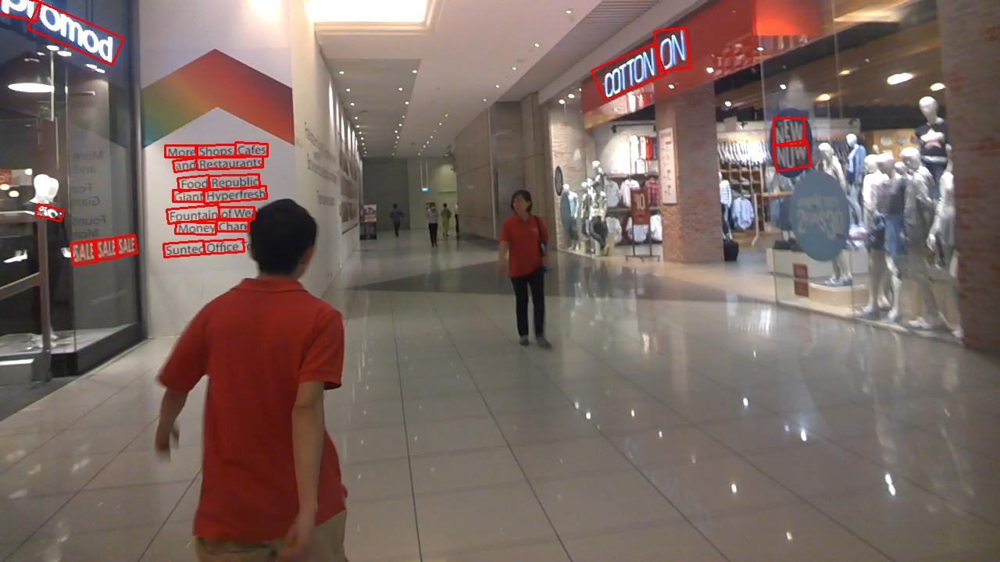

# Shape Robust Text Detection with Progressive Scale Expansion Network

## Requirements
* pytorch 1.0
* pyclipper
* opencv3

## Update 
### 20190401

1. add author loss, the results are compared in [Performance](#Performance)


### Download
resnet50 and resnet152 model on icdar 2015: [bauduyun](https://pan.baidu.com/s/1rN0oGBRsdUYmcQUayMZUOA) extract code: rxjf

## Train
1. config the `trainroot`,`testroot`in [config.py](config.py)
2. use fellow script to run
```sh
python3 train.py
```

## Test
[eval.py](eval.py) is used to test model on test dataset

1. config `model_path`, `data_path`, `gt_path`, `save_path` in [eval.py](eval.py)
2. use fellow script to test
```sh
python3 eval.py
```

## Predict 
[predict.py](predict.py) is used to inference on single image

1. config `model_path`, `img_path`, `gt_path`, `save_path` in [predict.py](predict.py)
2. use fellow script to predict
```sh
python3 predict.py
```

The project is still under development.

<h2 id="Performance">Performance</h2>

### [ICDAR 2015](http://rrc.cvc.uab.es/?ch=4)
only train on ICDAR2015 dataset with single NVIDIA 1080Ti

my implementation with my loss use adam and warm_up

| Method                   | Precision (%) | Recall (%) | F-measure (%) | FPS(1080Ti) |
|--------------------------|---------------|------------|---------------|-----|
| PSENet-1s with resnet50 batch 8  | 81.13 | 77.03 | 79.03 | 1.76 |
| PSENet-2s with resnet50 batch 8  | 81.36 | 77.13 | 79.18 | 3.55 |
| PSENet-4s with resnet50 batch 8  | 81.00 | 76.55 | 78.71 | 4.43 |
| PSENet-1s with resnet152 batch 4 | 85.45 | 80.06 | 82.67 | 1.48 |
| PSENet-2s with resnet152 batch 4 | 85.42 | 80.11 | 82.68 | 2.56 |
| PSENet-4s with resnet152 batch 4 | 83.77 | 79.05 | 81.34 | 2.99 |

my implementation with my loss use adam and MultiStepLR

| Method                   | Precision (%) | Recall (%) | F-measure (%) | FPS(1080Ti) |
|--------------------------|---------------|------------|---------------|-----|
| PSENet-1s with resnet50 batch 8  | 83.39 | 79.29 | 81.29 | 1.76 |
| PSENet-2s with resnet50 batch 8  | 83.22 | 79.05 | 81.08 | 3.55 |
| PSENet-4s with resnet50 batch 8  | 82.57 | 78.23 | 80.34 | 4.43 |
| PSENet-1s with resnet152 batch 4 | 85.33 | 79.87 | 82.51 | 1.48 |
| PSENet-2s with resnet152 batch 4 | 85.36 | 79.73 | 82.45 | 2.56 |
| PSENet-4s with resnet152 batch 4 | 83.95 | 78.86 | 81.33 | 2.99 |

my implementation with author loss use adam and warm_up (to be test 50)

| Method                   | Precision (%) | Recall (%) | F-measure (%) | FPS(1080Ti) |
|--------------------------|---------------|------------|---------------|-----|
| PSENet-1s with resnet50 batch 8  | 83.33 | 77.75 | 80.44 | 1.76 | 
| PSENet-2s with resnet50 batch 8  | 83.01 | 77.66 | 80.24 | 3.55 |
| PSENet-4s with resnet50 batch 8  | 82.38 | 76.98 | 79.59 | 4.43 |
| PSENet-1s with resnet152 batch 4 | 85.16 | 79.87 | 82.43 | 1.48 |
| PSENet-2s with resnet152 batch 4 | 85.03 | 79.63 | 82.24 | 2.56 |
| PSENet-4s with resnet152 batch 4 | 84.53S | 79.20 | 81.77 | 2.99 |

my implementation with author loss use adam and MultiStepLR

| Method                   | Precision (%) | Recall (%) | F-measure (%) | FPS(1080Ti) |
|--------------------------|---------------|------------|---------------|-----|
| PSENet-1s with resnet50 batch 8  | 83.93 | 79.48 | 81.65 | 1.76 |
| PSENet-2s with resnet50 batch 8  | 84.17 | 79.63 | 81.84 | 3.55 |
| PSENet-4s with resnet50 batch 8  | 83.50 | 78.71 | 81.04 | 4.43 |
| PSENet-1s with resnet152 batch 4 | 85.16 | 79.58 | 82.28 | 1.48 |
| PSENet-2s with resnet152 batch 4 | 85.13 | 79.15 | 82.03 | 2.56 |
| PSENet-4s with resnet152 batch 4 | 84.40 | 78.71 | 81.46 | 2.99 |

official implementation use SGD and StepLR

| Method                   | Precision (%) | Recall (%) | F-measure (%) | FPS(1080Ti) |
|--------------------------|---------------|------------|---------------|-----|
| PSENet-1s with resnet50 batch 8  |  84.15 | 80.26  | 82.16 | 1.76 |
| PSENet-2s with resnet50 batch 8  |  83.61 | 79.82  | 81.67 | 3.72 |
| PSENet-4s with resnet50 batch 8  |  81.90 | 78.23  | 80.03 | 4.51 |
| PSENet-1s with resnet152 batch 4 |  82.87 | 78.76  | 80.77 | 1.53 |
| PSENet-2s with resnet152 batch 4 |  82.33 | 78.33  | 80.28 | 2.61 |
| PSENet-4s with resnet152 batch 4 |  81.19 | 77.13  | 79.11 | 3.00 |

### examples




### reference
1. https://github.com/liuheng92/tensorflow_PSENet
2. https://github.com/whai362/PSENet